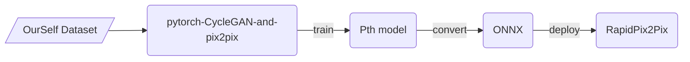
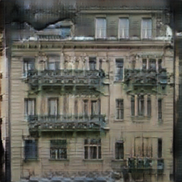

## RapidPix2Pix
- 本项目来源于[pytorch-CycleGAN-and-pix2pix](https://github.com/junyanz/pytorch-CycleGAN-and-pix2pix)。
- [pytorch-CycleGAN-and-pix2pix](https://github.com/junyanz/pytorch-CycleGAN-and-pix2pix)是一个很棒很好玩的项目，而且项目中提供了非常清晰明了的说明文档，简直是保姆级别的。
- 因为原始的pix2pix项目缺少落地的工程化代码，这也是RapidPix2Pix项目的来源。
- RapidPix2Pix旨在提供简单高效的推理代码，可以快速部署应用。

#### 使用生态


#### 使用步骤

1. 转换自己训练好的模型为ONNX格式 （或者 直接下载预训练模型 [Google Drive(208M)](https://drive.google.com/drive/folders/1AtNTfLOwwDV2iIKUK0B279o4Psk9sv0p?usp=sharing)）
   1. 在[pytorch-CycleGAN-and-pix2pix](https://github.com/junyanz/pytorch-CycleGAN-and-pix2pix)下的[`models/test_model.py`](https://github.com/junyanz/pytorch-CycleGAN-and-pix2pix/blob/9bcef69d5b39385d18afad3d5a839a02ae0b43e7/models/test_model.py#L63)添加以下转换代码：
        ```python
        def forward(self):
        """Run forward pass."""
        self.fake = self.netG(self.real)  # G(real)

        print('转onnx模型')
        import torch
        import onnxruntime
        import numpy as np

        save_onnx_path = 'facades_label2photo_pretrained.onnx'
        torch.onnx.export(self.netG,
                        self.real,
                        save_onnx_path,
                        export_params=True,
                        opset_version=11,
                        verbose=False,
                        input_names=['input'],
                        output_names=['output'],
                        do_constant_folding=True,
                        )

        ort_session = onnxruntime.InferenceSession(save_onnx_path)
        input_name = ort_session.get_inputs()[0].name
        ort_inputs = {input_name: self.real.numpy().astype(np.float32)}
        ort_outputs = ort_session.run(None, ort_inputs)[0]
        np.testing.assert_allclose(self.fake.numpy(), ort_outputs,
                                   rtol=1e-3, atol=1e-5)
        print('恭喜你，转换成功！')
        ```
    1. 运行测试程序来获得转换ONNX模型：
       - 以下程序均在[pytorch-CycleGAN-and-pix2pix](https://github.com/junyanz/pytorch-CycleGAN-and-pix2pix)目录下运行
            ```shell
            # 下载facades_label2photo数据集
            bash ./datasets/download_pix2pix_dataset.sh facades

            # 下载预训练模型
            bash ./scripts/download_pix2pix_model.sh facades_label2photo

            # 运行推理程序
            python test.py --dataroot ./datasets/facades/test/ \
                           --name facades_label2photo_pretrained \
                           --model test \
                           --netG unet_256 \
                           --direction BtoA \
                           --dataset_mode single \
                           --norm batch \
                           --gpu_ids -1
            ```
2. 安装运行环境
   ```shell
   pip install -r requirements.txt
   ```
3. 运行`main.py`
   ```shell
   python main.py
   ```
4. 查看结果

   
   